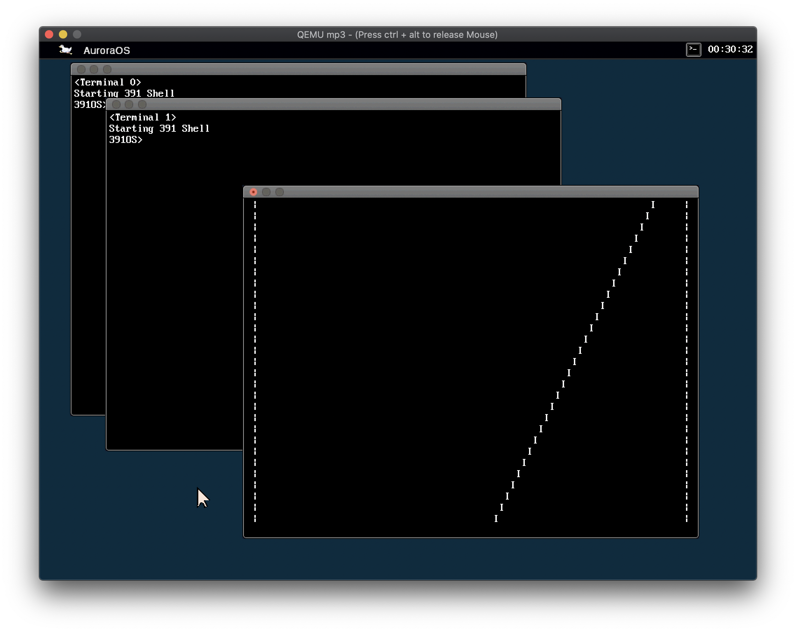

AuroraOS is an i386 operating system designed in ECE 391 MP3 Fall 2019 at UIUC.

NOTICE
-----
If you are working on your own ECE 391 project, **MAKE SURE** you follow the academic integrity regulations. **DO NOT**
copy code here without proper citation.

Authors
-----
Members of group 30:
* Zikai Liu (zikail2@illinois.edu)
* Tingkai Liu (tingkai2@illinois.edu)
* Qi Gao (qig2@illinois.edu)
* Zhenyu Zong (zhenyuz2@illinois.edu)

See commit history for contributions of each members.

FEATURES
-----
* Required by course
    * Setting up GDT, LDT and IDT
    * PIC i8259 driver
    * Keyboard
    * RTC
    * Memory Paging
    * Terminal Driver
    * MP3 read-only file system
    * Run user program
    * vidmap() system call
    * Round-robin scheduler based on PIT, 3 Terminals
* Extra
    * SVGA 1024 x 768 16-bit high color
        * Hardware acceleration
        * Support alpha blending
    * GUI with multiple terminals
        * Efficient rendering
            * Use hardware acceleration
            * Don’t render the invisible part
        * Double buffering
        * Support PNG resource
        * Startup animation
    * SVGA Hardware mouse
    * CMOS Datetime and GUI Clock
    * Music and beep using PIT
    * Interactive scheduling
        * Wait lists for terminal and RTC read()
    * Signals
    * Virtualized RTC
    * Cross compile toolchain for macOS



See project wiki for some detailed documents.

KNOWN ISSUES
-----
- Exception handlers blame user programs for all exceptions, even the exceptions happen in kernel.
- RTC is not really "real time." It restarts the timer every time read(). The frequency has been manually modified for demonstration. See FIXMEs in rtc.c.
- Keyboard failed to handle cases that left and right function keys are pressed at the same time.
- Now all tasks in wait queues are somewhat similar to Linux’s uninterpretable. For example, a shell in terminal read won’t respond to Ctrl+C until user presses enter.
- Now all tasks that use system calls are somewhat similar to Linux’s interactive. For example, when user presses enter, terminal read will return immediately, leaving the interrupt context unfinished.
- Now sigreturn() copies the whole HW context back without checking, which may lea to security problems.

REFERENCE
-----
* [SVGAlib](https://www.svgalib.org/) 1.4.3 source for SVGA driver. See [student-distrib/vga/SVGALIB_LICENSE](student-distrib/vga/SVGALIB_LICENSE) for original license.
* [elanthis/upng: very small PNG decoding library](https://github.com/elanthis/upng) for PNG loader. See [student-distrib/gui/UPNG_README.txt](student-distrib/gui/UPNG_README.txt) for original readme.
* [Cirrus Logic CL-GD5446 Technical Reference Manual](docs/SVGA-gd5446trm.pdf) for hardware cursor.
* Font data from MP2 by Prof. Lumetta.
For a few other reference, see comments in the code.

DIRECTORY LAYOUT AND SOME FILES
-----
```
.
├── docs                   Data sheets, documents and notes
├── fish                   Source code of fish user program
├── fsdir                  Things to be packed into file system
├── student-distrib        Main part of OS
│   ├── gui                    GUI related code
│   ├── task                   Program executing and scheduler related code
│   └── vga                    SVGA related code
├── syscalls               Source code of user programs
├── tools                  Tools and scripts
├── CMakeLists.txt         CMake configuration for cross compiling and CLion
├── README                 Original description of directory layout.
├── README.md              This file
├── README_ORIGINAL.md     Original cover README
└── debug_mac.sh           Helper script for cross compiling on macOS
```

ACADEMIC INTEGRITY
-----
Please review the University of Illinois Student Code before starting,
particularly all subsections of Article 1, Part 4 Academic Integrity and Procedure [here](http://studentcode.illinois.edu/article1_part4_1-401.html).

**§ 1‑402 Academic Integrity Infractions**

(a).	Cheating. No student shall use or attempt to use in any academic exercise materials, information, study aids, or electronic data that the student knows or should know is unauthorized. Instructors are strongly encouraged to make in advance a clear statement of their policies and procedures concerning the use of shared study aids, examination files, and related materials and forms of assistance. Such advance notification is especially important in the case of take-home examinations. During any examination, students should assume that external assistance (e.g., books, notes, calculators, and communications with others) is prohibited unless specifically authorized by the Instructor. A violation of this section includes but is not limited to:

(1)	Allowing others to conduct research or prepare any work for a student without prior authorization from the Instructor, including using the services of commercial term paper companies. 

(2)	Submitting substantial portions of the same academic work for credit more than once or by more than one student without authorization from the Instructors to whom the work is being submitted. 

(3) Working with another person without authorization to satisfy an individual assignment.

(b) Plagiarism. No student shall represent the words, work, or ideas of another as his or her own in any academic endeavor. A violation of this section includes but is not limited to:

(1)	Copying: Submitting the work of another as one’s own. 

(2)	Direct Quotation: Every direct quotation must be identified by quotation marks or by appropriate indentation and must be promptly cited. Proper citation style for many academic departments is outlined in such manuals as the MLA Handbook or K.L. Turabian’s A Manual for Writers of Term Papers, Theses and Dissertations. These and similar publications are available in the University bookstore or library. The actual source from which cited information was obtained should be acknowledged.

(3)	Paraphrase: Prompt acknowledgment is required when material from another source is paraphrased or summarized in whole or in part. This is true even if the student’s words differ substantially from those of the source. A citation acknowledging only a directly quoted statement does not suffice as an acknowledgment of any preceding or succeeding paraphrased material. 

(4)	Borrowed Facts or Information: Information obtained in one’s reading or research that is not common knowledge must be acknowledged. Examples of common knowledge might include the names of leaders of prominent nations, basic scientific laws, etc. Materials that contribute only to one’s general understanding of the subject may be acknowledged in a bibliography and need not be immediately cited. One citation is usually sufficient to acknowledge indebtedness when a number of connected sentences in the paper draw their special information from one source.

(c) Fabrication. No student shall falsify or invent any information or citation in an academic endeavor. A violation of this section includes but is not limited to:

(1)	Using invented information in any laboratory experiment or other academic endeavor without notice to and authorization from the Instructor or examiner. It would be improper, for example, to analyze one sample in an experiment and covertly invent data based on that single experiment for several more required analyses. 

(2)	Altering the answers given for an exam after the examination has been graded. 

(3)	Providing false or misleading information for the purpose of gaining an academic advantage.

(d)	Facilitating Infractions of Academic Integrity. No student shall help or attempt to help another to commit an infraction of academic integrity, where one knows or should know that through one’s acts or omissions such an infraction may be facilitated. A violation of this section includes but is not limited to:

(1)	Allowing another to copy from one’s work. 

(2)	Taking an exam by proxy for someone else. This is an infraction of academic integrity on the part of both the student enrolled in the course and the proxy or substitute. 

(3)	Removing an examination or quiz from a classroom, faculty office, or other facility without authorization.

(e)	Bribes, Favors, and Threats. No student shall bribe or attempt to bribe, promise favors to or make threats against any person with the intent to affect a record of a grade or evaluation of academic performance. This includes conspiracy with another person who then takes the action on behalf of the student.

(f)	Academic Interference. No student shall tamper with, alter, circumvent, or destroy any educational material or resource in a manner that deprives any other student of fair access or reasonable use of that material or resource. 

(1)	Educational resources include but are not limited to computer facilities, electronic data, required/reserved readings, reference works, or other library materials. 

(2)	Academic interference also includes acts in which the student committing the infraction personally benefits from the interference, regardless of the effect on other students.


LEGAL
-----
Permission to use, copy, modify, and distribute this software and its
documentation for any purpose, without fee, and without written agreement is
hereby granted, provided that the above copyright notice and the following
two paragraphs appear in all copies of this software.

IN NO EVENT SHALL THE AUTHOR OR THE UNIVERSITY OF ILLINOIS BE LIABLE TO
ANY PARTY FOR DIRECT, INDIRECT, SPECIAL, INCIDENTAL, OR CONSEQUENTIAL
DAMAGES ARISING OUT  OF THE USE OF THIS SOFTWARE AND ITS DOCUMENTATION,
EVEN IF THE AUTHOR AND/OR THE UNIVERSITY OF ILLINOIS HAS BEEN ADVISED
OF THE POSSIBILITY OF SUCH DAMAGE.

THE AUTHOR AND THE UNIVERSITY OF ILLINOIS SPECIFICALLY DISCLAIM ANY
WARRANTIES, INCLUDING, BUT NOT LIMITED TO, THE IMPLIED WARRANTIES OF
MERCHANTABILITY AND FITNESS FOR A PARTICULAR PURPOSE.  THE SOFTWARE

PROVIDED HEREUNDER IS ON AN "AS IS" BASIS, AND NEITHER THE AUTHOR NOR
THE UNIVERSITY OF ILLINOIS HAS ANY OBLIGATION TO PROVIDE MAINTENANCE,
SUPPORT, UPDATES, ENHANCEMENTS, OR MODIFICATIONS."
