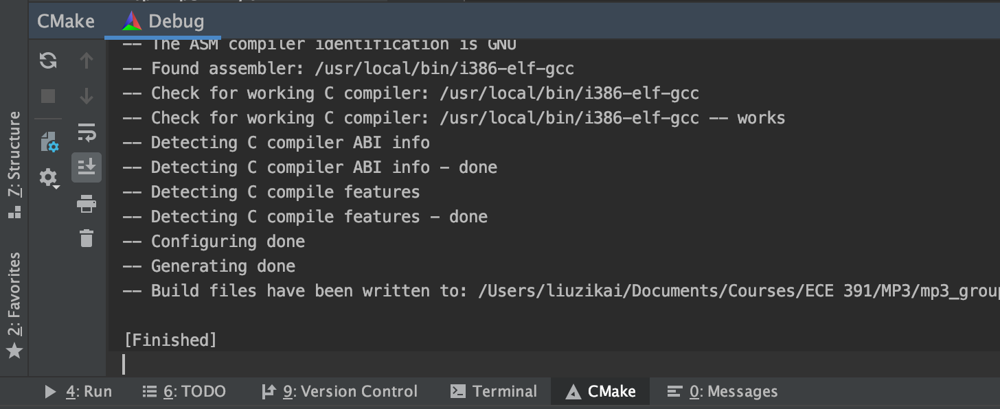

# Cross Compile Toolchain for macOS

## Revision History
* Initial version.  --liuzikai 2019/12/05

## Cross Compile Toolchain

Originally, this project should be compiled in devel VM in QEMU. 
In order to make development more easy, we develop a cross compile toolchain
to allow compiling the i386 kernel in macOS.

Notice that we can't guarantee that the OS behaves the same using
this toolchain as compiling in the devel VM. Use it at your own risk.
And it's highly recommended to have test with original configuration.

### Overview

The toolchain consists of the following parts.
* i386-elf-gcc for code compiling 
* fuse-ext2 for kernel image generation (ext3 support for macOS), 
with script debug_mac.sh (adapted from debug.sh)
* Other scripts

### Installation

1. Install [Homebrew](https://brew.sh/)
2. Install i386-elf-gcc
```shell
brew install i386-elf-gcc
```
3. Install [OSXFuse](https://osxfuse.github.io/)
4. Install dependencies of fuse-ext2
```shell
brew install m4 autoconf automake libtool e2fsprogs
xcode-select --installs
```
5. Clone, compile and install [fuse-ext2](https://github.com/alperakcan/fuse-ext2)
 (instead of using install script on its README, we install dependencies manually)
```shell
git clone https://github.com/alperakcan/fuse-ext2.git
cd fuse-ext2
./autogen.sh
CFLAGS="-idirafter/opt/gnu/include -idirafter/usr/local/include/osxfuse/ -idirafter/$(brew --prefix e2fsprogs)/include" LDFLAGS="-L/usr/local/opt/glib -L/usr/local/lib -L$(brew --prefix e2fsprogs)/lib" ./configure
make
sudo make install
```
6. (Maybe) Change log file owner for fuse-ext2 to allow mounting without root
```shell
chown <your user> /tmp/loggg
```

### Configuration in CLion

If CMakeLists.txt is load correctly, a target called "AuroraOS" will appears on the top right of CLion


CMake tab at the bottom of CLion will show that CMakeLists.txt is correctly loaded.



If not, use Tools - CMake - Reset Cache and Reload Project


In order to allow CLion to run test VM with Run command, we need to edit CLion configurations


Rename `AuroraOS` target to `Aurora_DEBUG`, and change Executable to `tools/391_test_kernel`. 


Duplicate `Aurora_DEBUG`, rename it to Aurora_NODEBUG, but this time set Program Arguments to `1`:


Now you can compile the OS with one-click on Build, and run test VM with Run buttons.


## Remote GDB

What's more, we can achieve remote gdb inside CLion, with the support of i386-elf-gdb.

### Installation
```shell
brew install i386-elf-gdb
```

### Configuration in CLion

Edit Configuration. Add a GDB Remote Debug configuration.


Set as follows:


First run AuroraOS_DEBUG, then switch to remote debug confiuration and start debug, 
test VM will start to run and you can use debug functions provides by CLion.


